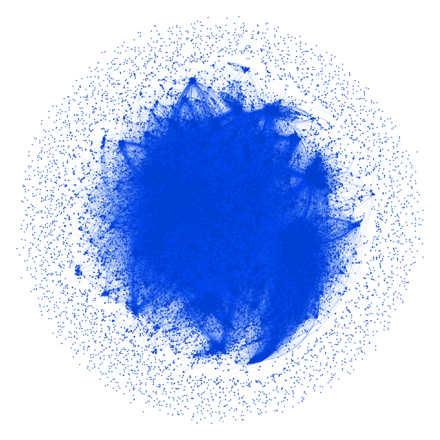
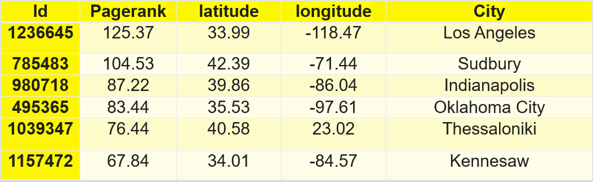
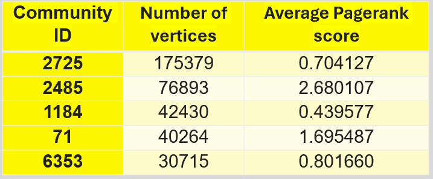
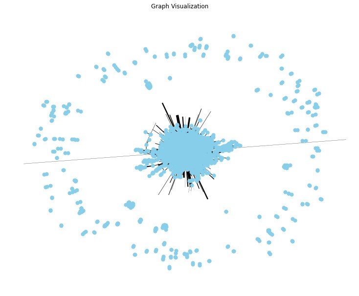

# Gowalla Social Network Analysis

## Description
Analyze the Gowalla dataset using Spark on Databricks

## Dataset
In this project, we use the Gowalla dataset from Stanford Network Analysis Project (SNAP). You can get this dataset [here](https://snap.stanford.edu/data/loc-Gowalla.html). However, this dataset is completely **clean**, so we have added some noises for this dataset. We will use this version for my project, you can get it [here](https://drive.google.com/file/d/1tqemyoqWgFCqk66aWZheDf_RW6DkKK_c/view?usp=sharing). This dataset has a total of 6442890 check-ins.

## Technology Stack
* Algorithm: DBSCAN, Pagerank, Label Propagation Algorithm (LPA), Markov Clustering (MCL)
* Pyspark and Graphframes
* Databricks

## Analysis Steps
* **Step 1**: Use DBSCAN to gather some points that are in the same tourist attraction.
* **Step 2**: Extract information about the tourists and their trajectories.
* **Step 3**: Build a graph from the results of two steps above.
* **Step 4**: Apply Pagerank and LPA on this graph.
* **Step 5**: Apply Markov Clustering and construct a popular route graph.

## Some results

*Figure 1: The result graph with 1268281 vertices and 5150236 edges*

*Figure 2: Six locations with the highest Pagerank scores*

*Figure 3: Five communities with the highest number of vertices*

*Figure 4: The popular route graph*

## Future plan
* Save the results into a graph database like Neo4J (Budgets needed)
* Build an application

